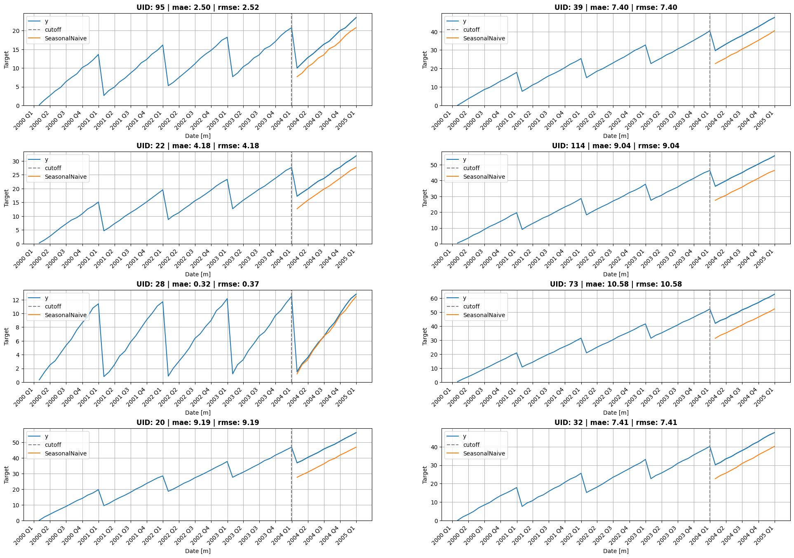
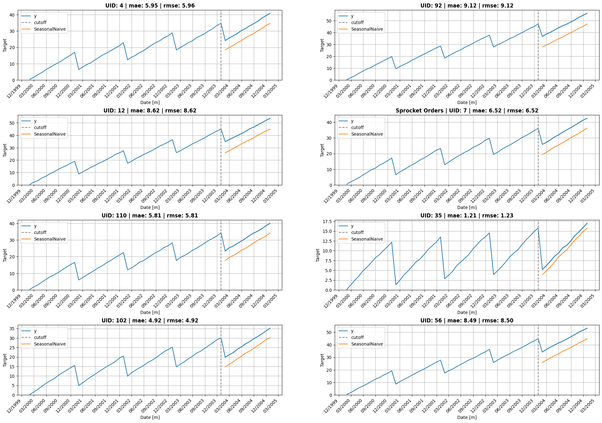
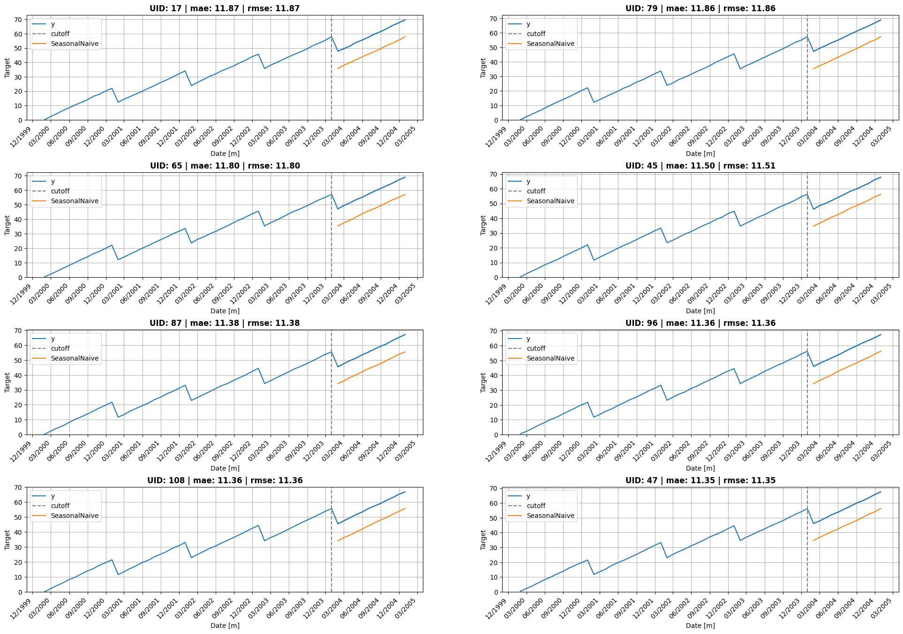
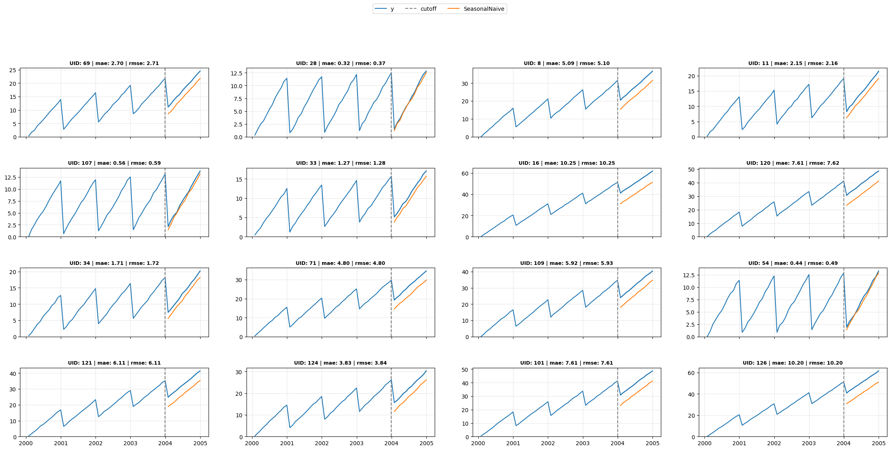

``` python
from statsforecast import StatsForecast
from statsforecast.models import SeasonalNaive, Naive, HistoricAverage
import pandas as pd
import matplotlib.pyplot as plt
import random
from itertools import product
import matplotlib.dates as mdates
```

<!-- WARNING: THIS FILE WAS AUTOGENERATED! DO NOT EDIT! -->

``` python
from utilsforecast.data import generate_series

Y_df = generate_series(n_series=128, freq='ME', min_length=60, max_length=60, with_trend=True)
Y_df
```

<div>
<style scoped>
    .dataframe tbody tr th:only-of-type {
        vertical-align: middle;
    }
&#10;    .dataframe tbody tr th {
        vertical-align: top;
    }
&#10;    .dataframe thead th {
        text-align: right;
    }
</style>

<table class="dataframe" data-quarto-postprocess="true" data-border="1">
<thead>
<tr style="text-align: right;">
<th data-quarto-table-cell-role="th"></th>
<th data-quarto-table-cell-role="th">unique_id</th>
<th data-quarto-table-cell-role="th">ds</th>
<th data-quarto-table-cell-role="th">y</th>
</tr>
</thead>
<tbody>
<tr>
<td data-quarto-table-cell-role="th">0</td>
<td>0</td>
<td>2000-01-31</td>
<td>0.274407</td>
</tr>
<tr>
<td data-quarto-table-cell-role="th">1</td>
<td>0</td>
<td>2000-02-29</td>
<td>2.227602</td>
</tr>
<tr>
<td data-quarto-table-cell-role="th">2</td>
<td>0</td>
<td>2000-03-31</td>
<td>4.041396</td>
</tr>
<tr>
<td data-quarto-table-cell-role="th">3</td>
<td>0</td>
<td>2000-04-30</td>
<td>5.882464</td>
</tr>
<tr>
<td data-quarto-table-cell-role="th">4</td>
<td>0</td>
<td>2000-05-31</td>
<td>7.691857</td>
</tr>
<tr>
<td data-quarto-table-cell-role="th">...</td>
<td>...</td>
<td>...</td>
<td>...</td>
</tr>
<tr>
<td data-quarto-table-cell-role="th">7675</td>
<td>127</td>
<td>2004-08-31</td>
<td>44.923498</td>
</tr>
<tr>
<td data-quarto-table-cell-role="th">7676</td>
<td>127</td>
<td>2004-09-30</td>
<td>46.361813</td>
</tr>
<tr>
<td data-quarto-table-cell-role="th">7677</td>
<td>127</td>
<td>2004-10-31</td>
<td>48.138033</td>
</tr>
<tr>
<td data-quarto-table-cell-role="th">7678</td>
<td>127</td>
<td>2004-11-30</td>
<td>49.535287</td>
</tr>
<tr>
<td data-quarto-table-cell-role="th">7679</td>
<td>127</td>
<td>2004-12-31</td>
<td>51.424035</td>
</tr>
</tbody>
</table>

<p>7680 rows × 3 columns</p>
</div>

``` python
sf = StatsForecast(
    models=[SeasonalNaive(season_length=12), Naive(), HistoricAverage()],
    freq='ME',
    n_jobs=-1
)

cv_df = sf.cross_validation(df=Y_df, h=12)
cv_df
```

<div>
<style scoped>
    .dataframe tbody tr th:only-of-type {
        vertical-align: middle;
    }
&#10;    .dataframe tbody tr th {
        vertical-align: top;
    }
&#10;    .dataframe thead th {
        text-align: right;
    }
</style>

<table class="dataframe" data-quarto-postprocess="true" data-border="1">
<thead>
<tr style="text-align: right;">
<th data-quarto-table-cell-role="th"></th>
<th data-quarto-table-cell-role="th">unique_id</th>
<th data-quarto-table-cell-role="th">ds</th>
<th data-quarto-table-cell-role="th">cutoff</th>
<th data-quarto-table-cell-role="th">y</th>
<th data-quarto-table-cell-role="th">SeasonalNaive</th>
<th data-quarto-table-cell-role="th">Naive</th>
<th data-quarto-table-cell-role="th">HistoricAverage</th>
</tr>
</thead>
<tbody>
<tr>
<td data-quarto-table-cell-role="th">0</td>
<td>0</td>
<td>2004-01-31</td>
<td>2003-12-31</td>
<td>41.918068</td>
<td>31.626313</td>
<td>51.954809</td>
<td>26.218289</td>
</tr>
<tr>
<td data-quarto-table-cell-role="th">1</td>
<td>0</td>
<td>2004-02-29</td>
<td>2003-12-31</td>
<td>43.812216</td>
<td>33.498739</td>
<td>51.954809</td>
<td>26.218289</td>
</tr>
<tr>
<td data-quarto-table-cell-role="th">2</td>
<td>0</td>
<td>2004-03-31</td>
<td>2003-12-31</td>
<td>45.785467</td>
<td>35.532154</td>
<td>51.954809</td>
<td>26.218289</td>
</tr>
<tr>
<td data-quarto-table-cell-role="th">3</td>
<td>0</td>
<td>2004-04-30</td>
<td>2003-12-31</td>
<td>47.589676</td>
<td>37.271197</td>
<td>51.954809</td>
<td>26.218289</td>
</tr>
<tr>
<td data-quarto-table-cell-role="th">4</td>
<td>0</td>
<td>2004-05-31</td>
<td>2003-12-31</td>
<td>49.734570</td>
<td>38.980048</td>
<td>51.954809</td>
<td>26.218289</td>
</tr>
<tr>
<td data-quarto-table-cell-role="th">...</td>
<td>...</td>
<td>...</td>
<td>...</td>
<td>...</td>
<td>...</td>
<td>...</td>
<td>...</td>
</tr>
<tr>
<td data-quarto-table-cell-role="th">1531</td>
<td>127</td>
<td>2004-08-31</td>
<td>2003-12-31</td>
<td>44.923498</td>
<td>36.354514</td>
<td>43.117257</td>
<td>21.773173</td>
</tr>
<tr>
<td data-quarto-table-cell-role="th">1532</td>
<td>127</td>
<td>2004-09-30</td>
<td>2003-12-31</td>
<td>46.361813</td>
<td>38.185409</td>
<td>43.117257</td>
<td>21.773173</td>
</tr>
<tr>
<td data-quarto-table-cell-role="th">1533</td>
<td>127</td>
<td>2004-10-31</td>
<td>2003-12-31</td>
<td>48.138033</td>
<td>40.096793</td>
<td>43.117257</td>
<td>21.773173</td>
</tr>
<tr>
<td data-quarto-table-cell-role="th">1534</td>
<td>127</td>
<td>2004-11-30</td>
<td>2003-12-31</td>
<td>49.535287</td>
<td>41.398671</td>
<td>43.117257</td>
<td>21.773173</td>
</tr>
<tr>
<td data-quarto-table-cell-role="th">1535</td>
<td>127</td>
<td>2004-12-31</td>
<td>2003-12-31</td>
<td>51.424035</td>
<td>43.117257</td>
<td>43.117257</td>
<td>21.773173</td>
</tr>
</tbody>
</table>

<p>1536 rows × 7 columns</p>
</div>

``` python
cutoff = pd.Timestamp('2003-12-31')
```

``` python
from utilsforecast.evaluation import evaluate
from utilsforecast.losses import mae, rmse

df_eval = evaluate(cv_df, metrics=[mae, rmse], models=['SeasonalNaive', 'Naive', 'HistoricAverage'])
df_eval
```

<div>
<style scoped>
    .dataframe tbody tr th:only-of-type {
        vertical-align: middle;
    }
&#10;    .dataframe tbody tr th {
        vertical-align: top;
    }
&#10;    .dataframe thead th {
        text-align: right;
    }
</style>

<table class="dataframe" data-quarto-postprocess="true" data-border="1">
<thead>
<tr style="text-align: right;">
<th data-quarto-table-cell-role="th"></th>
<th data-quarto-table-cell-role="th">unique_id</th>
<th data-quarto-table-cell-role="th">cutoff</th>
<th data-quarto-table-cell-role="th">metric</th>
<th data-quarto-table-cell-role="th">SeasonalNaive</th>
<th data-quarto-table-cell-role="th">Naive</th>
<th data-quarto-table-cell-role="th">HistoricAverage</th>
</tr>
</thead>
<tbody>
<tr>
<td data-quarto-table-cell-role="th">0</td>
<td>0</td>
<td>2003-12-31</td>
<td>mae</td>
<td>10.385087</td>
<td>5.577062</td>
<td>26.025675</td>
</tr>
<tr>
<td data-quarto-table-cell-role="th">1</td>
<td>1</td>
<td>2003-12-31</td>
<td>mae</td>
<td>7.175618</td>
<td>4.931577</td>
<td>17.871735</td>
</tr>
<tr>
<td data-quarto-table-cell-role="th">2</td>
<td>2</td>
<td>2003-12-31</td>
<td>mae</td>
<td>4.414868</td>
<td>4.718237</td>
<td>11.174016</td>
</tr>
<tr>
<td data-quarto-table-cell-role="th">3</td>
<td>3</td>
<td>2003-12-31</td>
<td>mae</td>
<td>0.999545</td>
<td>5.029895</td>
<td>3.747323</td>
</tr>
<tr>
<td data-quarto-table-cell-role="th">4</td>
<td>4</td>
<td>2003-12-31</td>
<td>mae</td>
<td>5.954271</td>
<td>4.808348</td>
<td>14.950838</td>
</tr>
<tr>
<td data-quarto-table-cell-role="th">...</td>
<td>...</td>
<td>...</td>
<td>...</td>
<td>...</td>
<td>...</td>
<td>...</td>
</tr>
<tr>
<td data-quarto-table-cell-role="th">251</td>
<td>123</td>
<td>2003-12-31</td>
<td>rmse</td>
<td>8.823970</td>
<td>5.917266</td>
<td>22.595332</td>
</tr>
<tr>
<td data-quarto-table-cell-role="th">252</td>
<td>124</td>
<td>2003-12-31</td>
<td>rmse</td>
<td>3.841348</td>
<td>5.698673</td>
<td>10.594876</td>
</tr>
<tr>
<td data-quarto-table-cell-role="th">253</td>
<td>125</td>
<td>2003-12-31</td>
<td>rmse</td>
<td>4.699834</td>
<td>5.533386</td>
<td>12.615176</td>
</tr>
<tr>
<td data-quarto-table-cell-role="th">254</td>
<td>126</td>
<td>2003-12-31</td>
<td>rmse</td>
<td>10.197017</td>
<td>6.425962</td>
<td>26.298619</td>
</tr>
<tr>
<td data-quarto-table-cell-role="th">255</td>
<td>127</td>
<td>2003-12-31</td>
<td>rmse</td>
<td>8.199264</td>
<td>5.921180</td>
<td>21.203321</td>
</tr>
</tbody>
</table>

<p>256 rows × 6 columns</p>
</div>

``` python
def plot_grid(df_train, df_test=None, df_eval=None, plot_random=True, model=None, level=None, ids=None, descs=None, date_fmt=None):
    if model is None and df_test is not None:
        models = [c for c in df_test.columns if c not in ('unique_id', 'ds', 'y', 'y_test', 'cutoff')]
        assert len(models) == 1, f"Multiple models found: {models}. Please specify `model`."
        model = models[0]
    fig, axes = plt.subplots(4, 2, figsize = (24, 16))

    unique_ids = df_train['unique_id'].unique()

    assert len(unique_ids) >= 8, "Must provide at least 8 ts"

    if plot_random:
        unique_ids = random.sample(list(unique_ids), k=8)
    else:
        unique_ids = ids

    for uid, (idx, idy) in zip(unique_ids, product(range(4), range(2))):
        train_uid = df_train.query('unique_id == @uid')
        line, = axes[idx, idy].plot(train_uid['ds'], train_uid['y'], label='y', )
        train_color = line.get_color()
        if df_test is not None:
            test_uid = df_test.query('unique_id == @uid')
            axes[idx, idy].axvline(x=test_uid['cutoff'].iloc[0], color='grey', linestyle='--', label='cutoff')
            for col in ['y', f'{model}', 'y_test']:
                if col in test_uid:
                    if col == 'y': axes[idx, idy].plot(test_uid['ds'], test_uid[col], color=train_color, label='_nolegend_')
                    else: axes[idx, idy].plot(test_uid['ds'], test_uid[col], label=col)
            if level is not None:
                for l, alpha in zip(sorted(level), [0.5, .4, .35, .2]):
                    axes[idx, idy].fill_between(
                        test_uid['ds'],
                        test_uid[f'{model}-lo-{l}'],
                        test_uid[f'{model}-hi-{l}'],
                        alpha=alpha,
                        color='orange',
                        label=f'{model}_level_{l}',
                    )

        # Build title — include MAE if eval data is available
        title = f'UID: {uid}'
        if descs is not None and uid in descs['unique_id'].values:
            title = f"{descs.query('unique_id == @uid')['desc'].values[0]} | {title}"
        if df_eval is not None and model is not None:
            eval_uid = df_eval.query('unique_id == @uid')
            if not eval_uid.empty and model in eval_uid.columns:
                metrics = ' | '.join(f'{r.metric}: {r[model]:.2f}' for _, r in eval_uid.iterrows())
                title += f' | {metrics}'
        axes[idx, idy].set_title(title, fontweight='bold')

        axes[idx, idy].set_xlabel('Date [m]')
        axes[idx, idy].set_ylabel('Target')
        axes[idx, idy].set_ylim(bottom=0)
        axes[idx, idy].legend(loc='upper left')
        if date_fmt in ('month', 'monthly'):
            axes[idx, idy].xaxis.set_major_locator(mdates.MonthLocator(interval=3))
            axes[idx, idy].xaxis.set_major_formatter(mdates.DateFormatter('%m/%Y'))
        elif date_fmt == 'quarter':
            axes[idx, idy].xaxis.set_major_locator(mdates.MonthLocator(bymonth=[1,4,7,10]))
            axes[idx, idy].xaxis.set_major_formatter(plt.FuncFormatter(lambda x, _: f"{mdates.num2date(x):%Y} Q{(mdates.num2date(x).month-1)//3+1}"))
        if date_fmt: plt.setp(axes[idx, idy].xaxis.get_majorticklabels(), rotation=45, ha='right')
        axes[idx, idy].grid()
    fig.subplots_adjust(hspace=0.5)
    plt.show()
    return None
```

``` python
descs = pd.DataFrame(dict(unique_id=[0, 3, 7], desc=['Widget Sales', 'Gizmo Revenue', 'Sprocket Orders']))
```

``` python
plot_grid(Y_df, cv_df.query("cutoff == @cutoff"),
          df_eval.query("cutoff == @cutoff"),
          model='SeasonalNaive', descs=descs, date_fmt="quarter")
```



``` python
plot_grid(Y_df, cv_df.query("cutoff == @cutoff"),
          df_eval.query("cutoff == @cutoff"),
          model='SeasonalNaive', descs=descs, date_fmt="month")
```



``` python
def select_uids(df_eval, model, metric='mae', mode='random', k=8):
    "Select k unique_ids: 'random', 'top' (best), or 'flop' (worst) by metric"
    sub = df_eval.query("metric == @metric")
    if mode == 'random': return random.sample(list(sub['unique_id'].unique()), k=k)
    ascending = mode == 'top'
    return sub.nsmallest(k, model)['unique_id'].tolist() if ascending else sub.nlargest(k, model)['unique_id'].tolist()
```

``` python
uids = select_uids(df_eval.query("cutoff == @cutoff"), 'SeasonalNaive', metric='mae', mode='flop')
plot_grid(Y_df, cv_df.query("cutoff == @cutoff"),
          df_eval.query("cutoff == @cutoff"),
          model='SeasonalNaive', plot_random=False, ids=uids, date_fmt="month")
```



``` python
def plot_grid_compact(df_train, df_test=None, df_eval=None, model=None, level=None, ids=None, descs=None, date_fmt=None, ncols=4, figw=28, rowh=3):
    if model is None and df_test is not None:
        models = [c for c in df_test.columns if c not in ('unique_id', 'ds', 'y', 'y_test', 'cutoff')]
        assert len(models) == 1, f"Multiple models found: {models}. Please specify `model`."
        model = models[0]
    if ids is None: ids = random.sample(list(df_train['unique_id'].unique()), k=min(16, len(df_train['unique_id'].unique())))
    nrows = -(-len(ids) // ncols)
    fig, axes = plt.subplots(nrows, ncols, figsize=(figw, rowh * nrows), sharex='col', squeeze=False)
    handles, labels = [], []

    for i, uid in enumerate(ids):
        r, c = divmod(i, ncols)
        ax = axes[r][c]
        train_uid = df_train.query('unique_id == @uid')
        line, = ax.plot(train_uid['ds'], train_uid['y'], label='y')
        train_color = line.get_color()
        if df_test is not None:
            test_uid = df_test.query('unique_id == @uid')
            ax.axvline(x=test_uid['cutoff'].iloc[0], color='grey', linestyle='--', label='cutoff')
            for col in ['y', f'{model}', 'y_test']:
                if col not in test_uid: continue
                if col == 'y': ax.plot(test_uid['ds'], test_uid[col], color=train_color, label='_nolegend_')
                else: ax.plot(test_uid['ds'], test_uid[col], label=col)
            if level is not None:
                for l, alpha in zip(sorted(level), [0.5, .4, .35, .2]):
                    ax.fill_between(test_uid['ds'], test_uid[f'{model}-lo-{l}'], test_uid[f'{model}-hi-{l}'], alpha=alpha, color='orange', label=f'{model}_level_{l}')
        title = f'UID: {uid}'
        if descs is not None and uid in descs['unique_id'].values:
            title = f"{descs.query('unique_id == @uid')['desc'].values[0]} | {title}"
        if df_eval is not None and model is not None:
            eval_uid = df_eval.query('unique_id == @uid')
            if not eval_uid.empty and model in eval_uid.columns:
                metrics = ' | '.join(f'{r.metric}: {r[model]:.2f}' for _, r in eval_uid.iterrows())
                title += f' | {metrics}'
        ax.set_title(title, fontsize=9, fontweight='bold')
        ax.set_ylim(bottom=0)
        ax.grid(True, alpha=0.3)
        if i == 0: handles, labels = ax.get_legend_handles_labels()
        if date_fmt in ('month', 'monthly'):
            ax.xaxis.set_major_locator(mdates.MonthLocator(interval=3))
            ax.xaxis.set_major_formatter(mdates.DateFormatter('%m/%Y'))
        elif date_fmt == 'quarter':
            ax.xaxis.set_major_locator(mdates.MonthLocator(bymonth=[1,4,7,10]))
            ax.xaxis.set_major_formatter(plt.FuncFormatter(lambda x, _: f"{mdates.num2date(x):%Y} Q{(mdates.num2date(x).month-1)//3+1}"))
        if date_fmt and r == nrows - 1: plt.setp(ax.xaxis.get_majorticklabels(), rotation=45, ha='right')

    for i in range(len(ids), nrows * ncols): axes[divmod(i, ncols)].set_visible(False)
    fig.legend(handles, labels, loc='upper center', ncol=len(labels), bbox_to_anchor=(0.5, 1.02), fontsize=10)
    fig.subplots_adjust(hspace=0.45)
    plt.show()
```

``` python
plot_grid_compact(Y_df, cv_df.query("cutoff == @cutoff"), df_eval.query("cutoff == @cutoff"), model='SeasonalNaive', descs=descs)
```


